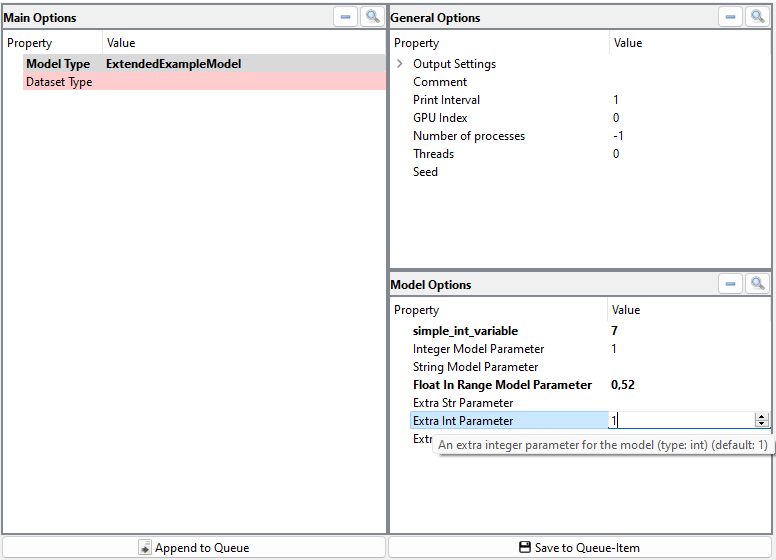
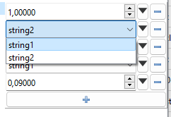
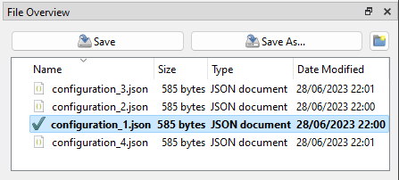
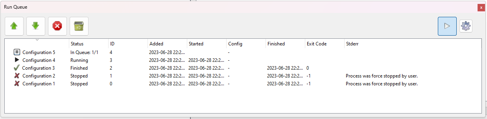
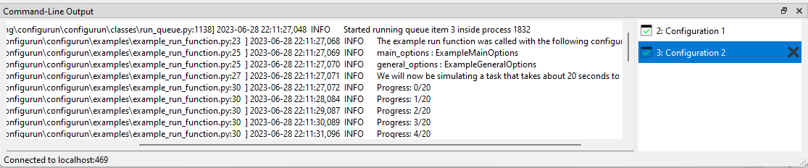
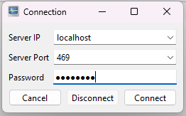

# Configurun

<p align="center">
	
</p>

Configurun is a cross-platform PySide6-based package that implements an application for managing, creating and (remotely) running python configurations. 
The app automatically generates editable GUIs based on an existing `argparse.Argumentparser` or a python-`@dataclass`, making it easy to view and edit parameters in an orginized manner - even when the amount of parameters is large.

Configurun was designed mainly with machine-learning tasks in mind, but can be used for any python script or framework that takes arguments as an input.

The Configurun-app is especially useful for scripts/experiments that require a lot of arguments to be tweaked across many experiment-runs. It also makes the process of running experiments remotely much easier by enabling the user to edit, add and schedule tasks on any running Configurun server-instance reachable via a network connection, or locally.

The following .gif, shows Configurun being used to generate a GUI for our multivariate time-series machine learning frameworks (MVTS-Learner)[https://github.com/Woutah/MVTS-Learner]:
<p align="center">
	
</p>
Note that the colors are a bit washed-out due to compression. 

Configurun was created in tandem with [pyside6-utils](https://github.com/Woutah/pyside6-utils/).

# Table of contents

- [Configurun](#configurun)
- [Table of contents](#table-of-contents)
- [Features](#features)
	- [Configuration Editor](#configuration-editor)
	- [Run Queue](#run-queue)
	- [Remote-processing](#remote-processing)
- [Installation](#installation)
- [How to run?](#how-to-run)
	- [Local App](#local-app)
	- [Client App](#client-app)
	- [Server-instance](#server-instance)
- [Option-source](#option-source)
	- [Custom Options (`@dataclass`)](#custom-options-dataclass)
	- [Custom Options (`ArgumentParser`)](#custom-options-argumentparser)
	- [Custom Options (`Callable`)](#custom-options-callable)
- [Target Function](#target-function)
- [Configuration](#configuration)
- [Option metadata](#option-metadata)
- [SSH-tunneling](#ssh-tunneling)
	- [No-hop](#no-hop)
	- [Hopping](#hopping)

# Features

## Configuration Editor

The configuration editor is automatically generated using either (groups of) [`@dataclass`-class](#custom-options-dataclass) or an [`ArgumentParser`-instance](#custom-options-dataclass). Editors are specifically created for each option-property based on the provided types (and [extra constraints](#option-metadata)). 
Help-messages are displayed on hover, required arguments are highlighted when not filled in, etc.
<p align="center">
	<!--  -->
	
</p>

More complex typehints using `List` / `Union` / `Literal` are supported and are automatically built into widgets that allow the user to add/remove items and switch input-types:

<p align="center">
	
	<!--  -->
</p>

We can also define our own [option-source-method](#custom-options-callable) to dynamically create new option-groups based on the current configuration. This can be useful if we want to group options together, and only show certain groups when an attribute of another group is set to a certain value. E.g: only show `ExtendedExampleModel`-options if property `model_type` in `MainOptions` is set to `"ExtendedExampleModel"`. <br>

Configurations can be saved and loaded, a file-explorer view for the current workspace is made available.:
<p align="center">
	<!--  -->
	
</p>

## Run Queue

The run-queue window manages the currently running items. This could either be locally when using a [local-app](#local-app), or remotely, when using a [client-app](#client-app) and a [server-instance](#server-instance) on which the actual Run-Queue is running. The Run-Queue allows us to add/remove items, pause/resume items, change the queue-order of items, and start autoprocessing, which will automatically start the next item in the queue when the current item is finished. We can set the number of processors as well, to run multiple items in parallel.
<p align="center">
	<!--  -->
	
</p>

Configurations are passed to the user-provided [target-function](#target-function) in separate processes. The stdout/stderr of each of the items is captured and displayed as a selectable console-output-view in the command-line-output window:
<p align="center">
	<!--  -->
	
</p>

## Remote-processing

Instead of using the [local-app](#local-app) to manage and run the configurations on your own machine, we can use the [client-app](#client-app) to connect to a [server-instance](#server-instance) on a remote machine. The client-app works analogous to the local-app and allows us to create and manage new configuration, but the Run-Queue runs on the connected remote Configurun-server:
<p align="center">
	<!--  -->
	
</p>

# Installation

This package can downloaded from [this repository](https://github.com/Woutah/configurun), or can be installed directly from PyPi by using pip:

``` bash
pip install configurun
```

# How to run?

Creating the app is done via the `configurun.create`-module. We can create 3 different types of apps:

- [**Local app**](#local-app) - For running everything locally on your machine
- [**Client app**](#client-app) - For running the configurations on a remote machine, connects to a `server`-instance
- [**Server instance**](#server-instance) - Command-line instance that listens to connections from `client`-apps. If login is succesful, accepts control of the `RunQueue` from the `client`-app.

On the client-side, the `options_source` should be set - the template of the settings used to create the [configuration-editor](#configuration-editor).<br>
On the server/running-machine, the `target_function` should be set - the function that actually runs the task/experiment ([example](#target-function)).<br>

## Local App

A local app is an all-in-one app that can be used to create and run configurations locally on your machine.
To run the example app, we can either call `run_example_app()` from `configurun.examples` or run the following code to construct the app ourselves:

```python
### This example will run the app with an example configuration
# Also see `configurun/examples/example_target_function.py`
# Also see `configurun/examples/example_deduce_new_option_class_types.py`
import os
from configurun.app import run_local
from configurun.examples import example_target_function, example_deduce_new_option_classes

if __name__ == "__main__": #Makes sure bootstrapping process is done when running app
	run_local( #Create and runs a local configurun app-instance
		target_function=example_target_function, #The function that will be called with the configuration
		options_source=example_deduce_new_option_classes, #Template for UI-optiosn: Callable/@datclass/ArgumentParser
		workspace_path = os.path.join( #Settings, configs and the Run-Queue will be saved/loaded from/to here
			os.getcwd(),
			"LocalExampleWorkspace"
		)
	)
```

In this example, [`example_target_function`](https://github.com/Woutah/configurun/blob/main/configurun/examples/example_target_function.py) runs a dummy task that logs to a file for 20 seconds. We can [specify our own target-function](#target-function) to run our own scripts.

We can [specify our own options source](#option-source) to create our own options-class for the configuration-editor, for example by [using an existing `ArgumentParser`-object.](#custom-options-argumentparser)

## Client App

We can create a client-app and use it to login to running [server](#server-instance)-instances. We can then use the client-app analogous to the [local-app](#local-app) to create new confiugrations and add/run/manage configurations on the remote machine.<br>

```python
# Opens a client-side app that we can use to connect to and control
# the server-instance
import os
from configurun.app import run_client
from configurun.examples import example_deduce_new_option_classes

if __name__ == "__main__":
	run_client(
		options_source=example_deduce_new_option_classes,
		workspace_path=os.path.join(os.getcwd(), "ClientExampleWorkspace"),
	)
```

## Server-instance

The server-instance is a command-line app that listens to connections from [`client`](#client-app)-instance(s) to receive new configurations and commands to manage its RunQueue. The actual target-functions are ran on this machine. <br>

**NOTE:** *after* authentication, `pickle`/`dill` is used to transmit data, which indirectly enables arbitrary code execution on the server-side if the password is known. Please run the server on trusted network environments only. Run at your own risk!

```python
# Opens a server-instance which tries to connect with clients and allows
# them to add configurations to the queue to be run on this machine
import os
from configurun.server import run_server
from configurun.examples.example_target_function import example_target_function

if __name__ == "__main__":
	# WARNING:
	# THIS ALLOWS OTHER MACHINES THAT RESIDE ON THE SAME NETWORK
	# TO EXECUTE ARBITRARY CODE ON THIS MACHINE IF THEY KNOW THE
	# PASSWORD. PLEASE RUN IN A TRUSTED NETWORK ENVIRONMENT ONLY
	# RUN AT YOUR OWN RISK!
	run_server(
		target_function=example_target_function,
		workspace_path=os.path.join(os.getcwd(), "ServerExampleWorkspace"),
		password="password", #Password to connect to the server, make sure to change this!
		port=5454 #Port to connect to the server, defaults to 5454
	)
```

# Option-source

When creating an app using the `create`-module, we can define a custom source, using the `options_source=...`, so we can construct the UI using our own options.
We can use the following types as an options-source:

- [`@dataclass`-object](#custom-options-dataclass)
- [`ArgumentParser`-object](#custom-options-argumentparser)
- [`Callable`](#custom-options-callable)

## Custom Options (`@dataclass`)

**NOTE:** Using `@dataclass`-fields results in more control over the final UI, for a more thorough example, please see [this section](#option-metadata) and/or the example implementations in [configurun/examples/example_options/example_options.py](https://github.com/Woutah/configurun/blob/main/configurun/examples/example_options/example_options.py).

**NOTE:**  When implementing custom option-classes, don't forget to add the `@dataclass`-decorator, and always inherit from `BaseOptions`

UI-supported type-hints include `str`, `int`, `float`, `datatime`, `typing.Literal`  (and more) and combinations using `typing.List`, `typing.Union` / `|`. For example:

```python
import os
import typing
from dataclasses import dataclass
from configurun.configuration.base_options import BaseOptions
from configurun.app import run_local
from configurun.examples import example_target_function


@dataclass #Don't forget to add this(!) - otherwise the app will not recognize the fields
class MyCustomOptions(BaseOptions): #Always inherit from BaseOptions (required to run config)
	simple_int : int = 1
	complex_property : typing.List[typing.Union[int, str]] | None = None # Union = |-notation
	# etc...

if __name__ == "__main__":
	run_local(
		target_function=example_target_function,
		options_source=MyCustomOptions, #Simple: each configuration consists of a single options-class
		workspace_path = os.path.join(os.getcwd(), "ExampleDataclassOptions")
	)


```

## Custom Options (`ArgumentParser`)

We can use a `ArgumentParser`-object as an options source, this will internally convert the argument parser into a `@dataclass`-object, which is then used as an options-class. Whenever possible, arguments are also parsed to the UI (e.g. `required=True`, `help="Will be displayed on hover"` etc.).

```python
import argparse
import os
from configurun.app import run_local
from configurun.examples import example_target_function

parser = argparse.ArgumentParser()
parser.add_argument("--required_arg", type=str, required=True, help="Required argument help")
#... add more arguments here

if __name__ == "__main__":
	run_local(
		target_function=example_target_function,
		options_source=parser, #Parser is converted internally to a dataclass-class which is used as the options-class
		workspace_path = os.path.join(os.getcwd(), "ExampleArgparseOptions")
	)
```

## Custom Options (`Callable`)
We define an `option`-class as a class that has the `@decorator` and inherits from the `BaseOptions`-class.

A configuration is a collection of option-instances, which are grouped toghether in a [`Configuration()`](#configuration)-wrapper, which enables us to access the attributes of all enclosed options-instances using the `configuration[attribute]` / `configuration.<attribute>` / `option_class.get(attribute, default)`. For more information, see [this section](#configuration).

As an options-source, we can create a callable which takes the current Configuration-instance as an argument and returns 1 or more new options-classes (***not** instances*) which is called every time a setting is changed. If the types-change, the UI will be updated to reflect the new templates.
This can be useful if we want to group options together, and only show certain groups when an attribute of another group is set to a certain value. For example:

```python
#In this example, we will create a callable which returns new options-classes based on the
# current configuration
import os
import typing
from dataclasses import dataclass
from configurun.app import run_local
from configurun.examples import example_target_function
from configurun.configuration import BaseOptions, Configuration

@dataclass #NOTE: Always use @dataclass for options
class AlwaysTheSame(BaseOptions): #NOTE: Always use BaseOptions as base class for options
	base_int : int = 1
	#...

@dataclass
class CustomOptionsDefault(BaseOptions):
	simple_int : int = 1
	#...

@dataclass
class CustomOptionsUnderConditions(BaseOptions):
	simple_int : int = 2
	some_more_options : str = 'Some string'
	#...

def deduce_new_option_classes(configuration: Configuration)\
		-> typing.Dict[str, typing.Type[BaseOptions | None]]: #Always return a dict of option
	 		# classes the key of the dict is the name/group of the option-class
			# the value is the option-class (@dataclass & BaseOptions) itself
	if configuration.options is None or len(configuration.options) == 0:
		pass #If initial configuration is being retrieved -> return default dict
	elif configuration.base_int == 2 and configuration.simple_int != 1:
		#Only return the CustomOptionsUnderConditions-class when base_int == 2 & simple_int != 1
		#NOTE: if we're not sure if attributes exist, we can use the `.get(key, default)` method
		return { #UI will be built using the following option-classes, each key gets a tab/window:
			'always_the_same' : AlwaysTheSame,
			'custom_options' : CustomOptionsUnderConditions
		}

	return { #UI will be built using the following option-classes, each key gets a tab/window:
		'always_the_same' : AlwaysTheSame,
		'custom_options' : CustomOptionsDefault
	} #NOTE: we must ALWAYS return a dictionary with at least 1 option class

if __name__ == '__main__':
	run_local(
		target_function=example_target_function,
		options_source=deduce_new_option_classes,
		workspace_path = os.path.join(os.getcwd(), "ExampleCallableOptions")
	)

```

# Target Function

The target function is the function that does all the work. This is the function that is being called when an item starts "running" in the Run-Queue.
It takes a single argument: a [`Configuration`-instance](#configuration).
The configuration-object contains all settings as set by the user when "add to queue" was pressed. 

This example uses the example-configuration from [the Configuration section](#configuration), we simply print the values of the configuration to the console:

```python
def target_function(configuration: Configuration):
	#Do something with the configuration
	print(configuration.simple_int)
	print(configuration.some_other_int)
	#etc.
```

If you have replaced an `argparse.Argumentparser`, this is the place where you insert the user-provided settings to the script that uses the `ArgumentParser`-object. For example:

```python
# parsed_args = parser.parse_args() #will be done by user in UI
# your_framework_that_used_parsed_args(parsed_args) #Will be called in target_function

def target_function(configurtion : Configuration):
	# Since we can use the Configuration-instance as a dict
	# and as configuration.<attribute> we can just
	# pass it to the framework compatible with the ArgumentParser:
	your_framework_that_used_parsed_args(configuration)
```

Of course you can also directly pass the `your_framework_that_used_parsed_args(...)`-function as the target function when creating the app:

```python
if __name__ == '__main__':
	local_app(
		target_function=your_framework_that_used_parsed_args,
		options_source=deduce_new_option_classes,
		workspace_path = os.path.join(os.getcwd(), "ExampleCallableOptions")
	)
```

This example uses the `deduce_new_option_classes`-function from [callable option source example](#custom-options-callable) .

# Configuration

Configurun works with `configuration`-objects. A configuration is a collection of option-instances (=`@dataclass`-instances that inherit from `BaseOptions`), which are grouped toghether in a `Configuration`-wrapper.
We can think of the option-instances as the different groups of options we want to edit and use in our run (e.g. `GeneralOptions()`, `LogOptions()`, `ModelOptions()`, etc.).
In the simplest case, we have 1 single option-instance which contains all the options, for example: `AllOptions()`.

The `Configuration`-wrapper enables us to access the attributes of all enclosed options-instances using `configuration[attribute]`/`configuration.<attribute>`/`option_class.get(attribute, default)`.

An example of how to use a `Configuration`-instance:

``` python
from dataclasses import dataclass
from configurun.configuration import Configuration
from configurun.configuration import BaseOptions

@dataclass
class GeneralOptionsClass(BaseOptions):
	simple_int : int = 1
	#etc.

@dataclass
class OtherOptionClass(BaseOptions):
	some_other_int : int = 2
	#etc.


# Normally, the following would be done by the app using the UI
# input and/or the user-provided option-source
config = Configuration()
config.options['general_options'] = GeneralOptionsClass()
config.options['other_options'] = OtherOptionClass()

#Accessing the options, all of the following are equivalent:
print(config['simple_int'])
print(config.simple_int)
print(config.get('simple_int', -1))) #Would return -1 if key-error occurs

#These are also equivalent:
print(config['some_other_int'])
print(config.some_other_int)
print(config.get('some_other_int', -1)))

# Note that we can use the config.<attr>-notation to our advantage
# when we want to use autocomplete in our editor. For example:
# def target_function(configuration: GeneralOptionsClass)
# Would result in our editor of choice recognizing/autocompleting
# the `configuration.simple_hint` way of accessing `simple_hint`
```

# Option metadata

The UI is mainly built around the [`field()`](https://docs.python.org/3/library/dataclasses.html#dataclasses.field) functionality of python-`dataclass`, which allows the display-model to make use of the default values, type hints and other information.
While typehints (e.g. `int`, `str`, `typing.List[int]`, etc.) are enough to create the editors, we can also provide additional information in the `metadata`-attribute of `field()` to further constrain the editors and provide additional information to the user. <br>

For example:

```python
from configurun.configuration import base_options
from dataclasses import field, dataclass
#Used to constrain the editors: (can also be imported from sklearn)
from pyside6_utils.classes.constraints import Interval, ConstrainedList

@dataclass
class TestOptions(BaseOptions):
	test_int_list_property : typing.List[int] | None = field(
		default=None, #The default value used in the UI
		metadata=dict( #Contains additional information for the UI
			display_name="Test property", #The display-name
			help="This is a test property that can also be none", #On-hover help-messagem
			required=True, #If required, the field is red if not filled in
			constraints = [ #Limit editors (min/max, options, etc.)
				#The following constrains the editor to have value > 1
				ConstrainedList([Interval(type=int, left=1, right=None, closed="both")]),
				None #Or value can be None
			]
			# etc...
		)
)
```

For more examples, please see the [example-options](https://github.com/Woutah/configurun/blob/main/configurun/examples/example_options/example_options.py).

The following metadata-keys are supported:

| Metadata Key | Type | Description |
| --- | --- | --- |
| `"display_name"` | `str` | Name to display for this attribute in the view - defaults to the variable name itself |
| `"display_path"` | `str` | Path to display this attribute - we can group/structure items when using a treeview - defaults to no parents|
| `"help"` | `str` | Help-message which will be shown when the user hovers over this item - empty by default|
| `"constraints"` | `List[sklearn_param_validation constraints]` | Additional constraints on which the editor will be determined to apply to the field [*](#constraintnote) , if none provided, use typehint of the field|
| `"required"` | `bool` | Whether this field is required to be filled in - if true - a red background will appear if the value is not set|
| `"editable"` | `bool` | Whether this field is editable - if false - the editor will be disabled|

<a name="constraintnote">*=</a>Constraints are (almost entirely) sourced from the `sklearn.utils._validation` module and provides a way to constrain the dataclass fields such that the user can only enter valid values. They are also packed into this package under `classes.constraints`. The following constraints are supported:
| Constraint | Description | Editor Type
| --- | --- | --- |
| `type` | The type of the value should match the type of the constraint | based on type |
| `Options` / `Container` | The value should be one of the options provided in the constraint | `QComboBox` |
| `StrOptions` | The value should be one of the str-options provided in the constraint | `QComboBox` |
| `Interval` | The value should be within the interval provided in the constraint | `QSpinBox` or `QDoubleSpinBox` (limited) |
| `None` | `None` is a valid value for this field, same as `typing.Optional` | Adds reset-button to editor |
| `Range` | The value should be within the range provided in the constraint | `QSpinBox` (limited) |
| `ConstrainedList` | [*(Custom - not part of Sklearn)](#constrainedlist) Indicates a list of of values of a constrained type | Based on type of list |

<a name="constrainedlist">*=</a>For example, `ConstrainedList([Interval(float, 0.0, 1.0), StrOptions(["string1", "string2"])])` indicates a list of values that should either be a float between 0.0 and 1.0, or the string "string1" or "string2". The editor for this field would be constructed as a `WidgetList` to which the user can add `WidgetSwitcher`. The `WidgetSwitcher` would then have two widgets, one with a `QSpinBox` and one with a `QComboBox` as the editor. **NOTE:** the same editor would be parsed from a `Typing.List[typing.Union[float, Typing.Literal["string1", "string2"]]]` typehint, minus the bounded-interval constraint on the float:
<p align="center">
	
	<!--  -->
</p>

# SSH-tunneling

This section contains a quick tutorial on how to use SSH-tunnels to connect to a remote server-instance in case we're not running client and server on the same machine/network.

## No-hop

A SSH-tunnel can be used to forward `localhost:5454` on the client-instance-side to `<remote>:5454` on the server side so we connect to the server instance without permanently port forwarding any ports on the server-side.
If we can directly SSH into the target machine, we can connect the ports as follows (assuming we're using the default `5454`-port in both the server and client configuration):

```bash
ssh -L 5454:localhost:5454 user@remote_host
```

On the client-side, we can then connect to the server-instance by using `localhost:5454` as the host and the password we set in the server-instance.

## Hopping
If we cannot directly access the remote-machine, we can use a 2-step SSH-tunnel to connect to the server-instance.
This example assumes we have:

- `remote1`: directly accessible from our machine
- `remote2`: only accessible from `remote1`
- Using default Configurun-port `5454` on both the client and server-side

We can then connect to `remote2` from our machine using the following command:

```bash
ssh -J <username1>@<remote1>, <username2>@<remote2> -L 5454:localhost:5454
```

This example forwards `localhost:5454`->`remote2:5454`, so we can connect to the server-instance on `remote2` by using `localhost:5454` as the host and the password we set in the server-instance.
